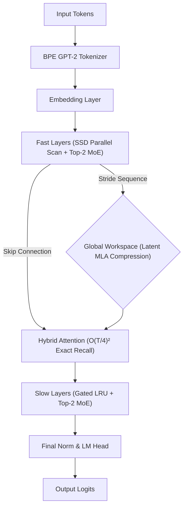

# NEURON-1: Hybrid Sparse MoE Architecture

> A ~20.15M parameter Hybrid SSM-Attention architecture modernized for 2026 frontier standards, created by Om Mishra.

## Architecture Overview

NEURON-1 is a high-performance hybrid model that integrates **Sparse Mixture of Experts (MoE)** routing, **Multi-head Latent Attention (MLA)** memory compression, and **Hardware-Aware Parallel Scans (SSD)**. It is designed to overcome the quadratic scaling limitations of pure Transformers while maintaining exact associative recall.

### Flow Diagram



## Key Innovations (Phase 7-11 Modernization)

| Component | Technology | Benefit |
|---|---|---|
| **Sparse MoE** | Top-2 / 8 Expert Routing | 20M parameter capacity with 5M parameter compute cost. |
| **MLA Workspace** | Latent KV Compression | Compresses massive context traces into a fixed-size latent bottleneck $c_t$. |
| **Parallel SSD** | Hardware-Aware Scans | Converts O(N) sequential state loops into O(log N) parallel GPU kernels. |
| **Hybrid Inject** | O((T/4)²) Attention | Injects exact short-term recall without breaking linear sequence complexity. |
| **BPE Tokenizer** | GPT-2 AutoTokenizer | 50,257 vocabulary for massively increased structural learning. |

## Quick Start (Free Tier Training)

NEURON-1 is optimized for training on **Free Cloud GPUs** (Google Colab T4 / Kaggle).

### 1. Setup Environment
```bash
pip install torch transformers datasets accelerate
```

### 2. Phase 1 Training (TinyStories BPE)
This script streams the TinyStories dataset and auto-saves checkpoints to your designated Drive map.
```bash
python train.py
```

### 3. Phase 2 Training (General Knowledge & Code)
Once your Phase 1 loss crosses below `0.15`, launch the Phase 2 curriculum. This seamlessly loads your latest checkpoint and injects Wikipedia, Math, Coding, conversational data, and Identity synthetics.
```bash
python train_phase2.py
```

### 4. Interactive Chat & Generation
Talk to your AI locally through the command line!
```bash
# Autoregressive generation given a prompt
python generate.py

# Streaming terminal chatbot
python chat.py
```

## Implementation Notes
The architecture uses **Structured State Space Duality (SSD)** for its fast layers. This reformulates the True Delta Rule into a parallel associative scan using scalar decay, enabling massive training speedups on modern hardware while maintaining strong semantic logic and multi-hop reasoning capabilities. The padding masking in the BPE update is strictly guarded to prevent sequence leakage during compound loss calculations.

---
*NEURON-1: Bridging the gap between Recurrent Efficiency and Attention Precision. Built by Om Mishra.*
